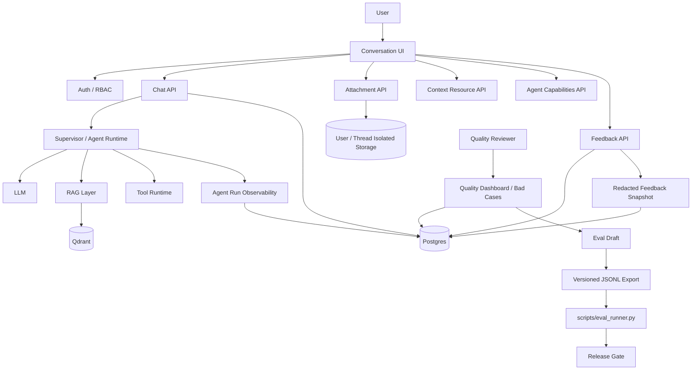

# CareerCrew 多用户对话能力与 Agent Feedback / Eval 详细技术方案

> 文档定位：研发设计文档 / 技术方案 / 评审基线  
> 适用范围：CareerCrew 全部对话式 Agent 模块，包括规划、职位匹配、面试、简历、会诊和知识库  
> 方案原则：多租户隔离优先、消息可追踪优先、隐私授权优先、质量数据可闭环、Eval 可回归

---

## 1. 背景与目标

CareerCrew 当前已经具备基础对话能力，但围绕多用户隔离、消息稳定标识、会话级交互、用户反馈、Bad Case 分析和离线 Eval 之间仍缺少统一的数据与流程闭环。

本方案的目标不是单独增加“点赞 / 点踩”“附件”“搜索”等 UI 功能，而是建立一套完整的对话基础设施，使每一次 Agent 回答都能够被：

1. 唯一定位；
2. 关联到一次确定的 Agent Run；
3. 关联到模型、Prompt、Agent 版本；
4. 关联到 RAG、Tool Call 等运行过程；
5. 被用户评价；
6. 在获得授权后进入质量分析；
7. 被人工归因；
8. 转换为可版本化的 Eval Case；
9. 在后续版本发布时参与质量回归。

最终形成：

```text
用户对话
   ↓
稳定 Message / Turn / Run
   ↓
Feedback
   ↓
Bad Case
   ↓
人工归因
   ↓
Eval Dataset
   ↓
离线 / 在线评估
   ↓
发布门禁
   ↓
新版本
   ↓
继续采集用户反馈
```

---

# 2. 核心设计原则

## 2.1 多租户边界高于功能便利

所有对话、附件、简历、私有知识库、反馈和运行快照必须拥有明确的 `user_id` 或可回溯到唯一 owner。

任何客户端提交的：

- `user_id`
- `thread_id`
- `document_id`
- `resume_id`
- `tool_id`
- `message_id`

都不能直接作为授权依据。

服务端必须根据当前认证用户重新校验资源所有权和可见范围。

---

## 2.2 Message 是质量系统的最小可评价对象

点赞、点踩、重新生成、复制、来源查看、工具查看等行为都应该绑定稳定的 `message_id`。

禁止继续使用：

- React 临时 key；
- 前端生成的 message ID；
- 数组 index；
- 流式回答结束后临时拼接 ID。

Assistant Message 必须由后端生成稳定 ID，并在流式 `done` 事件中返回。

---

## 2.3 Turn 与 Run 分离

一次用户问题对应一个 `turn_id`。

一次模型执行对应一个 `run_id`。

重新生成时：

```text
Turn 不变
Run 改变
Assistant Message 改变
```

示例：

```text
turn_id = T100

User Message = U100

第一次回答：
run_id = R100
message_id = A100

重新生成：
run_id = R101
message_id = A101
regenerated_from_message_id = A100
```

这样可以比较：

- 同一问题不同模型的表现；
- 同一问题不同 Prompt 版本的表现；
- 同一问题不同 Agent 版本的表现；
- 用户最终选择或评价了哪个回答。

---

## 2.4 Feedback 不是训练数据授权

用户点击 👍 / 👎 只代表对回答质量的反馈。

只有明确勾选：

> 允许保存脱敏后的相关对话片段，用于产品质量改进

才允许生成包含正文的 `feedback_snapshot`。

否则只允许保存：

- message_id
- run_id
- rating
- reason
- Agent / Model / Prompt 元数据
- 聚合统计

不得保存额外对话正文。

---

## 2.5 Observability 默认保存诊断元数据，不保存高风险正文

默认记录：

- Prompt Version
- Agent Version
- 模型
- token
- latency
- Retrieval 文档 / chunk ID
- Retrieval score
- Tool name
- Tool 状态
- Tool 执行耗时
- Tool 输出摘要
- 错误类型

默认不记录：

- 完整 System Prompt
- 内部 Chain-of-Thought
- Tool Secret
- 完整敏感 Tool 输出
- 其他用户数据
- 完整 RAG chunk 正文

---

# 3. 总体架构



---

# 4. 角色与权限模型

系统角色：

```text
admin
quality_reviewer
user
```

## 4.1 权限矩阵

| 能力 | user | quality_reviewer | admin |
|---|---:|---:|---:|
| 查看自己的私有对话 | ✅ | ❌ | ❌ |
| 查看自己的附件 | ✅ | ❌ | ❌ |
| 查看自己的知识库 | ✅ | ❌ | ❌ |
| 查看公共知识库 | ✅ | ✅（仅质量分析必要元数据） | ✅ |
| 提交 Feedback | ✅ | ❌ | ❌ |
| 查看自己 Feedback | ✅ | ❌ | ❌ |
| 查看聚合质量指标 | ❌ | ✅ | 可选，只读 |
| 查看未授权反馈正文 | ❌ | ❌ | ❌ |
| 查看授权并脱敏的反馈快照 | ❌ | ✅ | ❌ |
| Bad Case 归因 | ❌ | ✅ | ❌ |
| Promote Eval Case | ❌ | ✅ | ❌ |
| 创建 / 禁用账号 | ❌ | ❌ | ✅ |
| 重置密码 | ❌ | ❌ | ✅ |
| 分配角色 | ❌ | ❌ | ✅ |
| 查看用户普通私有对话 | 仅本人 | ❌ | ❌ |

核心原则：

> admin 是账户与系统管理角色，不自动拥有私有业务数据访问权。

---

## 4.2 最后一个管理员保护

管理员角色变更接口执行前必须检查：

```text
active_admin_count > 1
```

以下操作不能使系统失去最后一个有效管理员：

- 禁用账号；
- 移除 admin；
- 删除 admin；
- 锁定 admin。

建议事务内执行：

```sql
SELECT COUNT(*)
FROM users
WHERE role = 'admin'
  AND status = 'active'
FOR UPDATE;
```

再进行角色更新。

---

# 5. 历史数据迁移

## 5.1 Qdrant 迁移

迁移前：

1. 创建 Qdrant snapshot；
2. 记录 snapshot ID；
3. dry-run 扫描历史数据；
4. 校验待迁移项目数量为 `232`；
5. 生成迁移报告。

迁移规则：

```text
无 owner 的历史私有数据
→ owner_user_id = u_001
```

迁移后再次执行 dry-run：

```text
changed = 0
conflicts = 0
unowned = 0
```

否则视为迁移失败。

### 迁移报告至少包含

```json
{
  "snapshot_id": "...",
  "scanned": 232,
  "updated": 232,
  "conflicts": 0,
  "unresolved": 0,
  "started_at": "...",
  "finished_at": "..."
}
```

---

## 5.2 Account DB → Postgres

旧：

```text
data/db/accounts.db
```

迁移到 Postgres：

- users
- password credentials / hashes
- role
- account status
- created_at
- updated_at

不迁移：

- old refresh token
- old session
- old device session

迁移完成后：

```text
所有用户重新登录
```

并在部署说明中明确这是预期行为。

---

# 6. 统一 ID 模型

所有模块统一：

```text
thread_id
turn_id
message_id
run_id
```

## 6.1 thread_id

代表一次完整会话。

生命周期：

```text
create
→ active
→ cleared / renamed
→ deleted
```

---

## 6.2 turn_id

一次用户请求及其对应 Agent 回答版本集合。

```text
Turn
├── user_message
└── assistant_versions[]
```

---

## 6.3 message_id

每一条用户或 Agent Message 都拥有唯一稳定 ID。

推荐 UUIDv7，便于：

- 唯一性；
- 基于时间排序；
- 分布式生成；
- 数据库索引局部性。

---

## 6.4 run_id

每次 Agent 执行唯一。

包括：

- 首次回答；
- regenerate；
- retry；
- 自动恢复后的新执行。

---

# 7. 推荐核心数据模型

## 7.1 conversations

```sql
CREATE TABLE conversations (
    id UUID PRIMARY KEY,
    user_id UUID NOT NULL,
    module VARCHAR(50) NOT NULL,
    title VARCHAR(255),
    retrieval_scope JSONB,
    created_at TIMESTAMPTZ NOT NULL,
    updated_at TIMESTAMPTZ NOT NULL,
    last_active_at TIMESTAMPTZ NOT NULL,
    deleted_at TIMESTAMPTZ
);

CREATE INDEX idx_conversations_user_updated
ON conversations(user_id, updated_at DESC);
```

---

## 7.2 conversation_turns

```sql
CREATE TABLE conversation_turns (
    id UUID PRIMARY KEY,
    thread_id UUID NOT NULL REFERENCES conversations(id),
    user_id UUID NOT NULL,
    sequence_no INTEGER NOT NULL,
    created_at TIMESTAMPTZ NOT NULL,

    UNIQUE(thread_id, sequence_no)
);
```

---

## 7.3 messages

```sql
CREATE TABLE messages (
    id UUID PRIMARY KEY,
    thread_id UUID NOT NULL,
    turn_id UUID NOT NULL,
    user_id UUID NOT NULL,

    role VARCHAR(20) NOT NULL,
    content TEXT NOT NULL,

    run_id UUID,
    regenerated_from_message_id UUID,

    status VARCHAR(20) NOT NULL,

    created_at TIMESTAMPTZ NOT NULL,
    completed_at TIMESTAMPTZ,

    deleted_at TIMESTAMPTZ
);
```

推荐 status：

```text
pending
streaming
completed
failed
cancelled
```

---

# 8. Agent Run 数据模型

## 8.1 agent_runs

```sql
CREATE TABLE agent_runs (
    id UUID PRIMARY KEY,

    user_id UUID NOT NULL,
    thread_id UUID NOT NULL,
    turn_id UUID NOT NULL,
    message_id UUID NOT NULL,

    module VARCHAR(50) NOT NULL,
    agent_id VARCHAR(100) NOT NULL,

    model VARCHAR(150) NOT NULL,
    prompt_version VARCHAR(80) NOT NULL,
    agent_version VARCHAR(80) NOT NULL,

    status VARCHAR(30) NOT NULL,

    input_tokens INTEGER,
    output_tokens INTEGER,
    total_tokens INTEGER,

    latency_ms INTEGER,

    langsmith_run_id VARCHAR(255),

    error_type VARCHAR(100),
    error_code VARCHAR(100),
    error_summary TEXT,

    started_at TIMESTAMPTZ NOT NULL,
    finished_at TIMESTAMPTZ,

    created_at TIMESTAMPTZ NOT NULL
);
```

### prompt_version

规范：

```text
sha256:<64 hex chars>
```

如：

```text
sha256:55d786d8...
```

缺失时：

```text
unversioned
```

不能：

```text
unknown
```

质量后台对 `unversioned` 必须显示告警。

---

## 8.2 agent_run_retrievals

建议将一次 query 与多个结果拆分：

```sql
CREATE TABLE agent_run_retrievals (
    id UUID PRIMARY KEY,
    run_id UUID NOT NULL,

    query_index INTEGER NOT NULL,
    query_text_redacted TEXT,

    scope VARCHAR(50),

    document_id VARCHAR(255),
    chunk_id VARCHAR(255),

    recall_score DOUBLE PRECISION,
    rerank_score DOUBLE PRECISION,

    rank_before INTEGER,
    rank_after INTEGER,

    used_in_final_context BOOLEAN NOT NULL DEFAULT FALSE,

    created_at TIMESTAMPTZ NOT NULL
);
```

不保存完整 chunk 正文。

如需诊断，可保存：

```text
chunk_hash
chunk_length
document_title_redacted
```

---

## 8.3 agent_run_tool_calls

```sql
CREATE TABLE agent_run_tool_calls (
    id UUID PRIMARY KEY,
    run_id UUID NOT NULL,

    tool_name VARCHAR(150) NOT NULL,

    input_redacted JSONB,
    output_summary TEXT,

    status VARCHAR(30) NOT NULL,

    duration_ms INTEGER,

    requires_hitl BOOLEAN NOT NULL DEFAULT FALSE,
    hitl_status VARCHAR(30),

    error_type VARCHAR(100),
    error_summary TEXT,

    started_at TIMESTAMPTZ,
    finished_at TIMESTAMPTZ,

    created_at TIMESTAMPTZ NOT NULL
);
```

---

# 9. 流式协议统一

所有对话模块统一 NDJSON / SSE 事件结构。

推荐事件类型：

```text
start
token
source
tool_start
tool_end
error
done
```

最终 `done`：

```json
{
  "type": "done",
  "thread_id": "uuid",
  "turn_id": "uuid",
  "message_id": "uuid",
  "run_id": "uuid",
  "model": "deepseek-ai/DeepSeek-V4-Flash",
  "prompt_version": "sha256:...",
  "agent_version": "git-sha",
  "status": "completed"
}
```

前端收到 `done` 后才能：

- 开启 Feedback；
- 开启 regenerate；
- 显示消息操作栏完整能力。

---

# 10. 对话页面交互设计

整体推荐结构：

```text
Workspace
├── Header
├── Search Overlay
├── Conversation Rail
├── Message Thread
└── Composer
    ├── Attachment
    ├── @ Mention
    └── Tools
```

---

# 11. 当前会话搜索

## 11.1 第一版范围

只搜索：

```text
当前已加载完整会话
```

不调用服务端。

搜索对象：

- 用户消息；
- Agent 消息。

不搜索：

- Tool 原始输出；
- Prompt；
- 隐藏元数据。

---

## 11.2 UI 状态

点击顶部搜索：

```text
Search
↓
紧凑 Search Bar
```

字段：

```text
keyword
current_match_index
total_matches
```

按钮：

```text
↑ previous
↓ next
Esc close
```

---

## 11.3 快捷键

只在 Conversation Workspace 聚焦时拦截：

```text
Ctrl+F
Cmd+F
```

不能全局抢占浏览器搜索。

实现建议：

```ts
if (
  workspaceRef.current?.contains(document.activeElement)
  || workspaceHovered
) {
   preventDefault()
   openConversationSearch()
}
```

---

## 11.4 搜索实现

建议建立内存索引：

```ts
type SearchableMessage = {
  messageId: string
  turnId: string
  text: string
  role: "user" | "assistant"
}
```

匹配结果：

```ts
type SearchMatch = {
  messageId: string
  start: number
  end: number
}
```

跳转使用：

```ts
element.scrollIntoView({
  behavior: "smooth",
  block: "center"
})
```

当前结果高亮颜色必须低饱和。

---

# 12. Conversation Rail

Rail 只映射用户问题。

```text
Turn 1 → marker
Turn 2 → marker
Turn 3 → marker
```

Marker 点击跳到对应 User Message。

推荐：

```text
width: 36px
marker width: 12px
active width: 22px
```

Hover 显示问题摘要。

使用 `IntersectionObserver` 识别 Active Turn。

不要把 Rail 做成第二 Sidebar。

---

# 13. 会话菜单

顶部 `...`：

```text
Rename
Copy conversation ID
Export Markdown
Export JSON
Clear messages
Delete conversation
```

---

## 13.1 Rename

接口：

```text
PATCH /api/threads/{thread_id}
```

```json
{
  "title": "新的标题"
}
```

权限：

```text
thread.user_id == current_user.id
```

---

## 13.2 Export Markdown

导出内容：

```markdown
# Conversation Title

## User

...

## Assistant

...

### Sources

...
```

不包含：

- token；
- system prompt；
- agent secret；
- 内部 Tool credential。

---

## 13.3 Export JSON

允许包含：

```json
{
  "thread": {},
  "messages": [],
  "sources": [],
  "runs": [
    {
      "model": "...",
      "prompt_version": "...",
      "agent_version": "...",
      "latency_ms": 1234
    }
  ]
}
```

不包含：

```text
完整 system prompt
完整 tool raw output
完整 hidden trace
其他用户信息
```

---

## 13.4 Clear

Clear 语义：

```text
保留 Conversation
保留 Title
保留 Retrieval Scope
删除 Message / Turn
```

必须二次确认。

建议逻辑删除后异步物理清理。

---

## 13.5 Delete

删除：

- thread
- messages
- turns
- feedback
- feedback snapshots
- ephemeral attachment
- run metadata（根据合规策略决定物理删除或去标识化）

建议创建 deletion job，避免跨表级联阻塞请求。

---

# 14. 会话附件

## 14.1 支持格式

```text
PDF
DOCX
PPTX
XLSX
MD
TXT
PNG
JPG
JPEG
```

限制：

```text
25 MB / file
5 files / turn
```

服务端必须验证：

```text
extension
MIME
magic bytes / file signature
size
```

---

## 14.2 Storage Key

不能使用用户文件名作为磁盘路径。

推荐：

```text
users/{user_id}/threads/{thread_id}/attachments/{attachment_uuid}
```

数据库保留：

```text
original_filename
mime_type
size
storage_key
```

---

## 14.3 Attachment 状态

```text
uploading
uploaded
parsing
ready
failed
deleted
saved_to_knowledge
```

---

## 14.4 推荐表

```sql
CREATE TABLE chat_attachments (
    id UUID PRIMARY KEY,

    user_id UUID NOT NULL,
    thread_id UUID NOT NULL,

    original_filename VARCHAR(500) NOT NULL,
    storage_key VARCHAR(1000) NOT NULL,

    mime_type VARCHAR(150),
    size_bytes BIGINT,

    status VARCHAR(30) NOT NULL,

    parser_type VARCHAR(100),
    parser_error TEXT,

    knowledge_document_id UUID,

    created_at TIMESTAMPTZ NOT NULL,
    last_used_at TIMESTAMPTZ NOT NULL,
    expires_at TIMESTAMPTZ
);
```

---

## 14.5 TTL

默认：

```text
最后活动后 7 天
```

建议每日定时 cleanup。

保存到知识库后：

```text
expires_at = NULL
```

---

# 15. @ Context Reference

用户可以引用：

```text
private knowledge document
public knowledge document
saved resume
```

不支持：

```text
@Agent
```

---

## 15.1 API

```text
GET /api/context/resources?types=knowledge,resume&q=...
```

服务端返回的资源必须已经经过：

```text
visibility filter
ownership filter
```

例如：

```json
{
  "items": [
    {
      "type": "knowledge_document",
      "id": "doc-id",
      "name": "RAG 技术笔记",
      "visibility": "private"
    }
  ]
}
```

---

## 15.2 请求

```json
{
  "mentions": [
    {
      "type": "knowledge_document",
      "id": "doc-id"
    }
  ]
}
```

服务端不能信任这个 ID。

必须再次校验：

```text
private:
resource.user_id == current_user.id

public:
resource.visibility == public
```

---

## 15.3 Retrieval 语义

Mention 是：

```text
本轮强制上下文
```

Auto RAG 是：

```text
Agent 自动检索
```

两者必须在 run metadata 中分开记录。

建议字段：

```text
retrieval_source = mention
retrieval_source = auto
```

---

# 16. Tools 授权模型

## 16.1 客户端看到的是服务端 Capability

```text
GET /api/agent/capabilities?module=chat
```

返回：

```json
{
  "tools": [
    {
      "id": "rag_query",
      "name": "Knowledge Search",
      "enabled": true,
      "requires_hitl": false
    }
  ]
}
```

---

## 16.2 客户端选择语义

用户选择：

```text
本轮允许 Agent 使用哪些 Tool
```

不等于：

```text
立即执行 Tool
```

---

## 16.3 服务端最终集合

```text
effective_tools =
client_requested_tools
∩
server_allowlist
∩
role_allowlist
∩
module_allowlist
```

任何一项不允许都不能调用。

---

## 16.4 HITL

有副作用 Tool：

- 投递职位；
- 发送消息；
- 接受 Offer；
- 实际谈薪动作；
- 外部系统写入；
- 真实账号修改。

流程：

```text
Agent requests tool
↓
tool_call status = awaiting_confirmation
↓
User approve / reject
↓
execute or cancel
```

---

# 17. 消息 Action Bar

User Message：

```text
Copy
Edit（后续）
More
```

Assistant Message：

```text
Copy
Like
Dislike
Regenerate
More
```

只有 completed Assistant Message 才显示：

```text
Like
Dislike
Regenerate
```

---

# 18. Copy

复制内容仅包含可见正文。

不复制：

```text
隐藏 run metadata
tool raw output
feedback
UI label
```

点击反馈：

```text
Copy icon → Check icon → 1.5s → Copy icon
```

---

# 19. Regenerate

第一版限制：

```text
只能重新生成当前线程最后一条完整 Assistant Message
```

原因：

- 避免中间历史被修改导致上下文分叉复杂；
- 降低 Thread branch 管理复杂度；
- 保持 MVP 清晰。

---

## 19.1 Regenerate 行为

旧：

```text
turn = T1
message = A1
run = R1
```

新：

```text
turn = T1
message = A2
run = R2
regenerated_from_message_id = A1
```

不覆盖 A1。

---

## 19.2 UI

```text
<   1 / 2   >
```

默认展示最新版本。

旧版本 Feedback 仍保留。

用户可切换查看。

---

# 20. Feedback UX

## 20.1 Like

```text
click 👍
↓
PUT feedback
↓
selected
↓
toast: 感谢反馈
```

无需原因。

---

## 20.2 Dislike

点击 👎 打开 Popover：

```text
这条回答哪里需要改进？

○ 回答不正确
○ 没有回答我的问题
○ 信息不完整
○ 太啰嗦
○ 不够清楚
○ 没有遵循我的要求
○ 工具执行有问题
○ 引用 / 来源有问题
○ 其他

[补充说明，可选]

[ ] 允许保存脱敏后的相关对话片段，用于产品质量改进

提交
```

授权项：

```text
默认不勾选
```

---

# 21. Feedback Schema

```sql
CREATE TABLE message_feedback (
    id UUID PRIMARY KEY,

    user_id UUID NOT NULL,
    thread_id UUID NOT NULL,
    turn_id UUID NOT NULL,
    message_id UUID NOT NULL,
    run_id UUID NOT NULL,

    rating VARCHAR(20) NOT NULL,
    reason VARCHAR(50),
    comment TEXT,

    share_context BOOLEAN NOT NULL DEFAULT FALSE,

    created_at TIMESTAMPTZ NOT NULL,
    updated_at TIMESTAMPTZ NOT NULL,

    UNIQUE(user_id, message_id)
);
```

rating：

```text
positive
negative
```

reason：

```text
incorrect
not_relevant
incomplete
too_verbose
unclear
instruction_failure
tool_failure
citation_failure
other
```

---

# 22. Feedback API

## PUT

```text
PUT /api/messages/{message_id}/feedback
```

Request：

```json
{
  "rating": "negative",
  "reason": "incorrect",
  "comment": "职位薪资信息已经过期",
  "share_context": true
}
```

服务端自动解析：

```text
thread_id
turn_id
run_id
agent_id
model
prompt_version
agent_version
```

客户端不能传这些字段作为可信值。

---

## DELETE

```text
DELETE /api/messages/{message_id}/feedback
```

行为：

```text
删除 feedback
删除 feedback snapshot
写 audit event（无正文）
```

---

## GET

```text
GET /api/threads/{thread_id}/feedback
```

仅用于恢复当前用户自己的反馈状态。

---

# 23. Feedback Snapshot

只有：

```text
negative
AND
share_context = true
```

才生成 Snapshot。

---

## 23.1 Snapshot 内容

最多：

```text
当前 User Message
当前 Assistant Message
前置最多 2 Turn
```

总正文：

```text
<= 12,000 chars
```

优先保留：

1. 当前用户问题；
2. 当前回答；
3. 最近前置上下文；
4. 更老内容最后截断。

---

## 23.2 Redaction Pipeline

写库前执行：

```text
email
phone
ID number
API key
token
secret
local path
home directory
access key
credential-like string
```

推荐同时记录：

```text
redaction_version
redaction_count
```

---

## 23.3 Schema

```sql
CREATE TABLE feedback_snapshots (
    id UUID PRIMARY KEY,

    feedback_id UUID NOT NULL UNIQUE,
    user_id UUID NOT NULL,

    snapshot_json JSONB NOT NULL,

    redaction_version VARCHAR(50) NOT NULL,
    redaction_count INTEGER NOT NULL,

    expires_at TIMESTAMPTZ NOT NULL,

    created_at TIMESTAMPTZ NOT NULL
);
```

TTL：

```text
90 days
```

---

# 24. Quality Reviewer 数据边界

Quality Reviewer 查询反馈时：

```text
feedback metadata
↓
if snapshot exists
    allow redacted content
else
    metadata only
```

绝不允许：

```text
通过 thread_id 回查用户完整私有 Conversation
```

即使 Reviewer 知道 thread_id 也必须被权限层拒绝。

Quality 系统只能读取专门的：

```text
feedback view
feedback snapshot
run diagnostics
```

不能借用普通 Chat 数据接口。

---

# 25. Quality Dashboard

路由：

```text
/quality
```

仅：

```text
quality_reviewer
```

---

## 25.1 核心指标

### Helpful Rate

```text
positive /
(positive + negative)
```

注意同时展示：

```text
feedback coverage
```

因为：

```text
80% Helpful Rate
```

如果只有 1% 用户反馈，不代表全量满意度。

---

## 25.2 Dashboard 指标

展示：

```text
Helpful Rate
Positive Count
Negative Count
Feedback Coverage
Negative Reason Distribution
RAG Failure Share
Tool Failure Share
Median Latency
P95 Latency
Avg Input Tokens
Avg Output Tokens
```

支持筛选：

```text
date range
module
agent
model
prompt version
agent version
```

---

## 25.3 建议增加版本趋势

```text
Prompt v10   74%
Prompt v11   79%
Prompt v12   82%
```

同时显示样本数：

```text
82% (n=321)
```

禁止只展示百分比。

---

# 26. Bad Case

Bad Case 来源：

```text
negative feedback
```

但正文是否可见取决于：

```text
share_context
```

---

## 26.1 列表字段

```text
feedback_id
created_at
module
reason
agent
model
prompt_version
agent_version
share_context
review_status
root_cause
```

---

## 26.2 筛选

支持：

```text
reason
agent
model
prompt version
agent version
module
date
status
root cause
share context
```

---

## 26.3 Detail

授权：

```text
显示 redacted snapshot
```

未授权：

```text
不显示正文
```

都可以展示：

```text
run metadata
retrieval document/chunk id
recall/rerank score
tool metadata
latency
token
error class
```

---

# 27. 人工归因

root cause：

```text
llm
prompt
rag_retrieval
reranker
tool
context
ambiguous_question
product_bug
unknown
```

状态：

```text
new
triaged
fixed
ignored
promoted_to_eval
```

---

## 27.1 feedback_reviews

```sql
CREATE TABLE feedback_reviews (
    id UUID PRIMARY KEY,
    feedback_id UUID NOT NULL UNIQUE,

    reviewer_user_id UUID NOT NULL,

    root_cause VARCHAR(50),
    status VARCHAR(50) NOT NULL,

    reviewer_note TEXT,

    created_at TIMESTAMPTZ NOT NULL,
    updated_at TIMESTAMPTZ NOT NULL
);
```

---

## 27.2 feedback_review_events

所有变更追加事件：

```sql
CREATE TABLE feedback_review_events (
    id UUID PRIMARY KEY,
    feedback_id UUID NOT NULL,
    reviewer_user_id UUID NOT NULL,

    event_type VARCHAR(50) NOT NULL,
    old_value JSONB,
    new_value JSONB,

    created_at TIMESTAMPTZ NOT NULL
);
```

---

# 28. Audit Log

以下行为必须审计：

```text
quality snapshot viewed
root cause changed
review status changed
eval draft created
eval case approved
account role changed
account disabled
password reset
conversation delete
feedback snapshot deleted
```

日志不能包含：

```text
完整反馈正文
```

建议：

```text
actor
action
resource_type
resource_id
metadata
timestamp
ip_hash / session id
```

---

# 29. Bad Case → Eval Dataset

只有满足：

```text
share_context = true
snapshot exists
redaction passed
```

才允许 Promote。

---

## 29.1 Eval Draft

创建：

```text
draft
```

必须补充：

```text
input
necessary_context
expected_behavior
rubric
failure_reason
target_agent
source_feedback_id
source_prompt_version
source_model
```

---

## 29.2 Eval Case 状态

```text
draft
approved
deprecated
```

只有：

```text
approved
```

才能导出。

---

## 29.3 Eval 表

```sql
CREATE TABLE eval_cases (
    id UUID PRIMARY KEY,

    source_feedback_id UUID,

    status VARCHAR(30) NOT NULL,

    target_agent VARCHAR(100) NOT NULL,

    input_text TEXT NOT NULL,
    context_json JSONB,

    expected_behavior TEXT,
    rubric JSONB NOT NULL,

    failure_reason VARCHAR(100),

    source_model VARCHAR(150),
    source_prompt_version VARCHAR(80),
    source_agent_version VARCHAR(80),

    created_by UUID NOT NULL,
    approved_by UUID,

    created_at TIMESTAMPTZ NOT NULL,
    approved_at TIMESTAMPTZ
);
```

---

# 30. JSONL Export

导出示例：

```json
{
  "id": "careercrew-eval-001",
  "agent": "job_match_agent",
  "input": "请推荐适合我的职位",
  "context": {
    "resume": "...redacted..."
  },
  "rubric": {
    "must_use_resume": true,
    "must_not_invent_jobs": true,
    "must_explain_match_reason": true
  },
  "source": {
    "feedback_id": "...",
    "failure_reason": "not_relevant"
  }
}
```

输出到：

```text
evals/
  careercrew/
    v1/
      cases.jsonl
```

服务端不直接修改 Git。

导出脚本由 CI / 开发人员执行。

---

# 31. Eval Runner 接入

现有：

```text
scripts/eval_runner.py
```

建议分两层。

## PR Gate

执行：

```text
deterministic
mocked
offline
```

适合：

```text
route selection
schema validation
tool permission
retrieval deterministic regression
redaction
RBAC
```

---

## Nightly / Manual

执行真实：

```text
LLM
RAG
Tool
```

用于：

```text
Route Accuracy
Hit@K
MRR
Citation Coverage
Tool Success Rate
Bad Case Pass Rate
Latency
Token Cost
```

---

# 32. 发布门禁

版本发布必须比较同一 Dataset。

例如：

```text
baseline = main
candidate = PR / release
```

规则示例：

```text
Bad Case pass rate
不得下降 > 2%

Route accuracy
不得下降 > 1%

Citation coverage
不得下降 > 3%

Tool success
不得下降 > 1%

P95 latency
不得上涨 > 20%

Avg token
不得上涨 > 25%
```

具体阈值后续依据历史数据校准。

核心要求：

> 修复某个 Bad Case 不能以明显破坏其他基线能力为代价。

---

# 33. A/B Testing

A/B 在数据稳定后再做。

原则：

```text
one experiment = one major variable
```

一次只比较：

```text
Prompt
or Model
or Retriever
or Reranker
```

不要多个一起改，否则无法归因。

---

## 33.1 Sticky Assignment

按：

```text
user_id hash
```

固定分桶。

例如：

```text
0-49 → A
50-99 → B
```

防止同一个用户每次请求版本不同。

---

## 33.2 实验指标

至少：

```text
Helpful Rate
Negative Rate
Reason Distribution
Task Success
Latency
Token
Cost
```

结果不能直接自动发布。

必须经过：

```text
A/B
↓
Offline Eval
↓
Reviewer / Engineering Review
↓
Release
```

---

# 34. API 清单

## Conversation

```text
POST   /api/threads
GET    /api/threads
GET    /api/threads/{thread_id}
PATCH  /api/threads/{thread_id}
DELETE /api/threads/{thread_id}

POST   /api/threads/{thread_id}/clear
GET    /api/threads/{thread_id}/export?format=md
GET    /api/threads/{thread_id}/export?format=json
```

---

## Messages / Regenerate

```text
POST /api/threads/{thread_id}/messages
POST /api/messages/{message_id}/regenerate
```

---

## Attachment

```text
POST   /api/chat/attachments
GET    /api/chat/attachments?thread_id=...
DELETE /api/chat/attachments/{attachment_id}
POST   /api/chat/attachments/{attachment_id}/save-to-knowledge
```

---

## Mention

```text
GET /api/context/resources?types=knowledge,resume&q=...
```

---

## Capabilities

```text
GET /api/agent/capabilities?module=chat
```

---

## Feedback

```text
PUT    /api/messages/{message_id}/feedback
DELETE /api/messages/{message_id}/feedback
GET    /api/threads/{thread_id}/feedback
```

---

## Quality

```text
GET /api/quality/metrics
GET /api/quality/bad-cases
GET /api/quality/bad-cases/{feedback_id}

PUT /api/quality/bad-cases/{feedback_id}/review

POST /api/quality/bad-cases/{feedback_id}/promote
```

---

## Eval

```text
GET  /api/quality/eval-cases
GET  /api/quality/eval-cases/{id}
PUT  /api/quality/eval-cases/{id}
POST /api/quality/eval-cases/{id}/approve
```

---

# 35. 前端组件建议

```text
src/components/chat/

ConversationWorkspace
├── ConversationHeader
│   ├── ConversationSearch
│   └── ConversationMenu
│
├── ConversationViewport
│   ├── ConversationRail
│   │   └── ConversationRailMarker
│   │
│   └── ConversationTurn
│       ├── UserMessage
│       │   └── UserMessageActions
│       │
│       └── AssistantMessage
│           ├── MarkdownRenderer
│           ├── SourceList
│           ├── ToolUsageSummary
│           ├── MessageVersionSwitcher
│           └── AssistantMessageActions
│               ├── Copy
│               ├── Like
│               ├── Dislike
│               ├── Regenerate
│               └── More
│
└── PromptComposer
    ├── AttachmentPicker
    ├── MentionPicker
    ├── ToolPicker
    └── SendButton
```

Quality：

```text
src/components/quality/

QualityDashboard
├── QualityFilters
├── HelpfulRateCard
├── FeedbackCoverage
├── ReasonDistribution
├── VersionComparison
└── QualityTrend

BadCaseList
BadCaseDetail
FeedbackSnapshotViewer
RunDiagnostics
RetrievalDiagnostics
ToolDiagnostics
ReviewPanel
PromoteToEvalDialog
```

---

# 36. 后端模块建议

```text
backend/

auth/
rbac/

chat/
  threads/
  messages/
  regeneration/

attachments/

context_resources/

agent/
  supervisor/
  capabilities/
  runtime/

observability/
  runs/
  retrieval/
  tools/

feedback/
  service/
  snapshot/
  redaction/

quality/
  metrics/
  bad_cases/
  reviews/

eval/
  cases/
  export/
```

---

# 37. 状态恢复

页面刷新后必须恢复：

```text
message history
message stable ID
feedback state
message version
attachment state
conversation title
```

不得依赖纯 React Memory。

前端 Store 只做缓存。

数据库是 Source of Truth。

---

# 38. 并发与幂等

Feedback：

```text
PUT
```

天然适合幂等。

唯一约束：

```text
(user_id, message_id)
```

---

Regenerate 建议加入 Idempotency Key：

```text
Idempotency-Key: uuid
```

避免用户双击导致生成两次。

---

附件上传也建议 Idempotency。

---

# 39. 删除语义

## Feedback 删除

```text
hard delete feedback snapshot
hard delete feedback
append audit deletion event
```

Audit 不含正文。

---

## Conversation 删除

建议：

```text
logical delete immediately
↓
background hard delete
```

用户 UI 立即不可见。

---

# 40. 隐私与脱敏

必须建立统一 Redaction Service，而不是不同模块各自写正则。

接口：

```python
redact(text, profile="feedback_snapshot")
```

输出：

```json
{
  "text": "...",
  "redaction_count": 5,
  "rules": [
    "email",
    "phone"
  ],
  "version": "redactor-v3"
}
```

建议脱敏：

```text
邮箱
手机号
身份证 / 护照格式
API Key
JWT
Bearer Token
Access Secret
文件系统绝对路径
用户 home path
数据库连接串
```

---

# 41. 安全测试重点

必须测试：

```text
User A 无法 GET User B Thread
User A 无法评价 User B Message
User A 无法删除 User B Attachment
User A 无法 @ User B Knowledge
User A 无法伪造 public/private visibility
User A 无法启用 server deny 的 Tool

Admin 无法调用普通 Conversation API 获取 User 私有会话

Quality Reviewer 无法查看未授权正文
Quality Reviewer 无法使用 thread_id 绕过 snapshot
Quality Reviewer 无法管理账号
```

---

# 42. 测试矩阵

## 42.1 Backend Unit

覆盖：

```text
RBAC
ownership
prompt version
agent version
feedback update
snapshot creation
snapshot revoke
redaction
regenerate relationship
tool allowlist intersection
attachment path validation
```

---

## 42.2 API Integration

关键测试：

```text
create conversation
send message
stream done
feedback
refresh feedback

regenerate
version switch metadata

attachment upload
cross-user deny

mention resources
cross-user deny

quality reviewer snapshot access
unauthorized snapshot deny
```

---

## 42.3 Frontend Component

```text
search open/close
Ctrl+F
next / previous result

conversation menu
feedback selected state
dislike popover
feedback restore

rail active marker
rail click scroll

attachment status
mention chip
tool selection

version 1/2 switch
```

---

## 42.4 E2E

场景：

```text
User Login
↓
Create Thread
↓
Upload PDF
↓
@ Resume
↓
Select Tools
↓
Ask Question
↓
Agent completes
↓
Dislike + Share Context
↓
Logout
↓
Reviewer Login
↓
Open Bad Case
↓
Root Cause
↓
Promote Eval
```

---

# 43. Metrics 与监控

## 产品指标

```text
feedback coverage
helpful rate
negative rate
regenerate rate
search usage
attachment usage
mention usage
tool opt-in usage
```

---

## 技术指标

```text
chat latency p50/p95
first token latency
tool duration
retrieval duration
attachment parse latency
stream failure rate
feedback API error rate
```

---

## 质量指标

```text
helpful rate by model
helpful rate by prompt version
negative reason by agent
tool_failure by tool
citation_failure by module
rag root cause share
```

---

# 44. 质量告警

建议后台增加：

```text
unversioned run rate > 0
```

直接告警。

其他：

```text
negative rate sudden spike
tool_failure spike
citation_failure spike
P95 latency regression
feedback API error spike
```

---

# 45. 实施阶段

## Phase 0：迁移与保护

目标：

```text
建立安全数据底座
```

任务：

- Qdrant snapshot；
- 232 项 owner migration；
- accounts.db → Postgres；
- force relogin；
- RBAC；
- quality_reviewer；
- last-admin protection。

验收：

```text
dry-run 0 changed
0 conflict
cross-user tests pass
```

---

## Phase 1：稳定 Message / Run

任务：

- UUID stable ID；
- Turn；
- Run；
- Agent Run table；
- done event；
- prompt SHA；
- git SHA；
- unversioned alert。

验收：

```text
刷新后 message_id 不变
同一 regenerate turn_id 不变
run_id / message_id 改变
```

---

## Phase 2：会话 UX

任务：

- 当前会话搜索；
- Conversation Rail；
- Conversation Menu；
- Copy；
- More Menu；
- export；
- clear；
- delete。

---

## Phase 3：Composer 能力

任务：

- Attachment；
- async parse；
- 7-day TTL；
- Save to Knowledge；
- @ Mentions；
- Tool capability；
- HITL integration。

---

## Phase 4：Feedback

任务：

- Like；
- Dislike；
- reason；
- optional comment；
- share_context；
- Feedback API；
- Feedback restore；
- snapshot；
- redaction；
- revoke。

---

## Phase 5：Quality

任务：

- Dashboard；
- Bad Cases；
- metadata-only access；
- snapshot viewer；
- Root Cause；
- Review Status；
- Audit Log。

---

## Phase 6：Eval

任务：

- Promote；
- Draft；
- Approve；
- Export JSONL；
- eval_runner；
- PR / nightly gate。

---

## Phase 7：A/B

前提：

```text
数据量足够
版本信息稳定
Eval 稳定
```

再实现：

- sticky buckets；
- experiment metadata；
- metric comparison。

---

# 46. Git 提交建议

每个阶段独立提交。

例如：

```text
feat(auth): migrate accounts to postgres and add reviewer role

feat(chat): add stable turn message and run ids

feat(chat): implement conversation search and navigation rail

feat(chat): add thread attachment lifecycle

feat(chat): add mention context resources

feat(agent): enforce per-turn tool capability allowlist

feat(feedback): persist message feedback and snapshot consent

feat(quality): add quality dashboard and bad-case review

feat(eval): promote approved bad cases into versioned eval dataset
```

避免一次 PR 混合：

```text
schema migration
UI
permissions
eval
```

否则难以审查和回滚。

---

# 47. Definition of Done

一个阶段完成必须同时满足：

```text
DB migration
backend tests
API tests
frontend tests
tenant isolation tests
lint
TypeScript
build
documentation
```

涉及 Agent 行为的阶段还必须：

```text
Eval gate pass
```

---

# 48. 验收清单

## Multi User

- [ ] User A 不能访问 User B Conversation。
- [ ] User A 不能访问 User B Attachment。
- [ ] User A 不能引用 User B Private Knowledge。
- [ ] Admin 不能直接查看 User Private Conversation。
- [ ] Reviewer 只能读取授权 Snapshot。
- [ ] 系统无法删除最后一个 Active Admin。

## Message / Run

- [ ] 所有模块返回稳定 message_id。
- [ ] 所有完成消息具有 turn_id / run_id。
- [ ] Prompt Version 可追踪。
- [ ] Agent Git SHA 可追踪。
- [ ] unversioned 被 Dashboard 告警。

## Conversation UX

- [ ] Search 可搜索 User + Agent Message。
- [ ] Next / Previous 正确。
- [ ] Ctrl/Cmd+F 只在 Workspace 生效。
- [ ] Rail Marker 点击正确跳转。
- [ ] Rename / Export / Clear / Delete 真实生效。

## Attachment

- [ ] 文件大小限制有效。
- [ ] MIME / signature 验证有效。
- [ ] 存储路径不能由客户端控制。
- [ ] 默认 7 天清理。
- [ ] Save to Knowledge 后取消 TTL。

## Mentions

- [ ] 仅本人 Private + Public。
- [ ] 后端再次校验资源。
- [ ] Mention 与 Auto RAG 单独记录。

## Tools

- [ ] Client Tool Selection 不能突破 Server Allowlist。
- [ ] HITL Tool 未授权不执行。
- [ ] 实际 Tool Calls 能在回答后查看。

## Feedback

- [ ] 刷新后反馈恢复。
- [ ] 用户只能评价自己的 Assistant Message。
- [ ] Like 不创建 Snapshot。
- [ ] Dislike + share_context 才创建 Snapshot。
- [ ] Revoke 删除正文 Snapshot。
- [ ] Reviewer 无法查看未授权正文。

## Regenerate

- [ ] 第一版只允许最后一条完整回答。
- [ ] Old Message 不覆盖。
- [ ] Old Feedback 保留。
- [ ] UI 可切换 1/2 版本。

## Quality

- [ ] Helpful Rate 有 Sample Size。
- [ ] Feedback Coverage 可见。
- [ ] Reason Distribution 可筛选。
- [ ] Bad Case 支持 Root Cause。
- [ ] Review 操作有 Audit。

## Eval

- [ ] Bad Case 可转 Draft。
- [ ] Draft 必须有 Rubric。
- [ ] Approved 才能 Export。
- [ ] Export 为版本化 JSONL。
- [ ] PR Eval 可执行。
- [ ] Nightly Eval 可执行。
- [ ] Release Gate 能阻止显著 Regression。

---

# 49. 风险与应对

## 风险 1：先做 Dashboard，后补稳定 ID

后果：

```text
历史 Feedback 无法可靠绑定真实 Agent Run
```

处理：

```text
必须先稳定 message / turn / run
```

---

## 风险 2：Reviewer 权限范围过大

后果：

```text
质量后台变成用户私有对话后门
```

处理：

```text
Quality API 与 Chat API 完全隔离
Reviewer 只能查询 Snapshot View
```

---

## 风险 3：Snapshot 脱敏不足

处理：

```text
统一 Redaction Service
版本化规则
审计
自动测试
90 天 TTL
用户撤销立即删除
```

---

## 风险 4：Tools 由客户端控制

处理：

```text
客户端只表达意愿
服务端做最终 Intersection
```

---

## 风险 5：Regenerate 覆盖旧回答

处理：

```text
Immutable Message
New Message + regenerated_from
```

---

## 风险 6：Eval Dataset 被错误样本污染

处理：

```text
Bad Case
→ Draft
→ Reviewer Rubric
→ Approval
→ Export
```

不能自动把所有 👎 直接进入 Eval。

---

# 50. 推荐最终里程碑

### M1 — Multi-Tenant Ready

```text
账号迁移
RBAC
数据归属
权限测试
```

### M2 — Traceable Conversation

```text
message_id
turn_id
run_id
prompt_version
agent_version
```

### M3 — Complete Chat UX

```text
search
rail
menu
attachment
mention
tools
regenerate
```

### M4 — User Feedback Closed Loop

```text
like
dislike
reason
consent
snapshot
redaction
```

### M5 — Quality Operations

```text
dashboard
bad cases
root cause
review workflow
audit
```

### M6 — Eval Driven Release

```text
eval cases
JSONL
runner
release gate
```

### M7 — Controlled Experimentation

```text
A/B
sticky bucket
statistical threshold
manual release
```

---

# 51. 最终结论

本方案最核心的不是某一个前端功能，而是建立以下链路：

```text
Stable Message
   ↓
Agent Run Snapshot
   ↓
User Feedback
   ↓
Privacy-safe Snapshot
   ↓
Quality Review
   ↓
Root Cause
   ↓
Eval Case
   ↓
Regression Gate
```

如果这条链路先建立好，后续无论 CareerCrew 增加新的 Agent、新模型、新 RAG 策略、新 Tool，质量数据都能复用同一套底座。

实施时必须坚持以下顺序：

```text
权限与数据归属
→ 稳定 ID
→ Run Observability
→ Chat UX
→ Feedback
→ Quality
→ Eval
→ A/B
```

不要反过来先做 Dashboard 或 Eval UI，否则早期采集的数据很容易因为缺少稳定 Message / Run / Version 关联而失去长期分析价值。

本设计完成后，CareerCrew 的对话系统将从“能聊天”升级为：

> **可追踪、可评价、可诊断、可回归、可持续优化的多用户 Agent 平台。**
