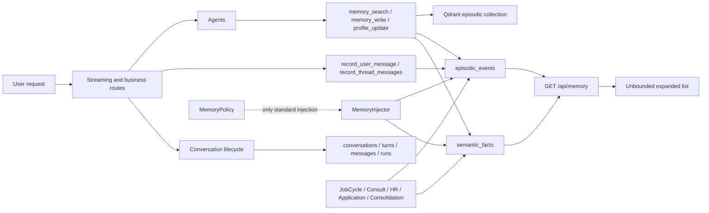
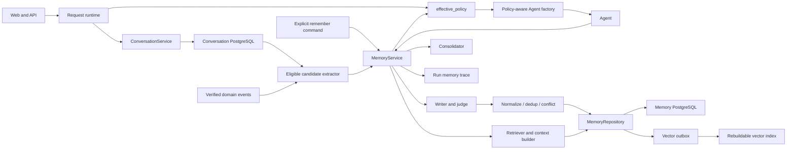

# CareerCrew Agent Long-Term Memory Implementation Plan

> Status: approved for execution on 2026-08-23. Implement with red-green TDD at the public seams listed below.

**Goal:** Separate Conversation History from Long-Term Memory, make one policy-aware `MemoryService` the only long-term-memory boundary, and replace the unbounded transcript-like Memory UI with a searchable, grouped, paginated management surface.

**Architecture:** Conversation remains the source of truth for messages, tool activity, runs, recovery, and current-thread context. Long-term memory stores only cross-session facts and important career events. Agents never access `semantic_facts`, `episodic_events`, or Qdrant directly; they receive policy-filtered tools and context from `MemoryService`. PostgreSQL is authoritative and the vector collection is a rebuildable index synchronized through deletion-aware service operations.

**Tech Stack:** FastAPI/Python, PostgreSQL/Alembic, Qdrant, React 19, TypeScript, Tailwind, pytest, Vitest/Testing Library.

## Global Constraints

- Preserve unrelated pre-existing working-tree changes, especially the in-progress resume stable-ID work.
- Do not add `Co-Authored-By` trailers.
- Conversation persistence must work when Memory is disabled.
- `memory_enabled=false` means zero automatic/manual long-term writes, zero search, zero injection, zero consolidation, zero vector writes, and no Memory tools bound to Agents.
- The authenticated owner may still list and delete retained Memory while use/generation is disabled.
- PostgreSQL is the source of truth; a stale vector point must never be injectable.
- Ordinary `user_message` and `agent_response` records must not be created in long-term memory.

## Public Test Seams

1. `MemoryPolicyStore.effective()` and the public `MemoryService` methods.
2. Runtime Agent capability/tool assembly.
3. `/api/memory`, `/api/memory/policy`, `/api/settings/memory`, and `/api/profile`.
4. `/api/threads/{thread_id}/messages` conversation recovery.
5. `MemoryPanel` and `MemorySettingsPanel` rendered behavior.

## 1. Current Architecture and Data Flow



### Current findings

- Conversation is already canonical in `conversations`, `conversation_turns`, `messages`, and `agent_runs`.
- The same user and assistant text is still written to `episodic_events` for legacy restoration.
- Standard `MemoryInjector` checks effective policy, but Agent tools, profile APIs, JobCycle profile preamble, Consult form persistence, interview recording, application tracking, HR monitoring, and consolidation bypass it.
- `semantic_facts` overwrites prior values while only incrementing a version number; previous content and multi-source provenance are lost.
- Memory deletion removes PostgreSQL rows but not episodic vectors.
- Episodic fallback reads oldest rows when a limit is present, and vector-result order is lost when IDs are resolved back through the event store.
- Memory UI merges all facts and events, sorts ascending, and expands every record.

## 2. Target Architecture



### Data boundaries

| Data | Source of truth | Long-term memory |
|---|---|---|
| User/assistant messages, tool calls/results, run state | Conversation | No |
| Resume files, jobs, applications and their full operational state | Domain stores | No |
| Stable skills, experience, direction, preferences and constraints | Memory | Yes |
| Confirmed application/interview/offer milestones | Memory as a minimal domain reference | Yes |
| Explicit "remember this" requests | Memory | Yes |

## 3. Data Model

Use a shared header plus type-specific detail tables so semantic and episodic memory are not reduced to one untyped JSON table.

### `memory_records`

- `id UUID`, `user_id`
- `memory_type`: `semantic | episodic`
- `category`
- `scope_type`: `global | domain | agent`
- `scope_key`
- `capture_mode`: `automatic | explicit | form | verified_event | consolidated | migration`
- `normalized_key`, `cardinality`, `canonical_hash`
- `display_text`
- `confidence`, `importance`, `source_quality`, `sensitivity`
- `lifecycle_class`
- `valid_from`, `valid_until`, `last_confirmed_at`, `last_accessed_at`, `access_count`
- `status`: `active | superseded | expired | deleted | quarantined`
- `schema_version`, `row_version`, timestamps

### `memory_semantic_values`

- `memory_id`
- `normalized_value JSONB`
- `value_type`, `unit`, `locale`, `value_hash`

### `memory_episodic_events`

- `memory_id`
- `event_type`, `occurred_at`
- `entity_type`, `entity_id`, `event_state`
- `event_payload JSONB`

### `memory_sources`

- `id`, `memory_id`, `source_type`
- `conversation_id`, `message_id`, `turn_id`, `run_id`, `agent_id`, `tool_call_id`
- `source_excerpt_redacted`, `asserted_by`, `evidence_strength`, `observed_at`

### `memory_relations`

- `from_memory_id`, `to_memory_id`
- `relation_type`: `supersedes | conflicts_with | supports | duplicate_of | derived_from | consolidates`
- `confidence`, `metadata`, `created_at`

### Supporting tables

- `memory_vector_outbox` for retryable `upsert/delete` operations.
- `agent_run_memory_traces` for policy, need detection, candidates, skip reasons, retrieved/injected/written IDs and latency.

## 4. Effective Policy

```python
memory_enabled = feature_flag and global_enabled and user_enabled and account_active
can_generate = memory_enabled and global_generate and user_generate
can_use = memory_enabled and global_use and user_use
can_manual_save = memory_enabled
can_consolidate = can_generate and can_use
```

Policy implications:

- `memory_enabled=false`: no Memory tools, writes, reads, injection, consolidation, vector writes, or background generation.
- `can_generate=false`: no automatic extraction, `memory_write`, `profile_update`, or consolidation; explicit user save remains allowed while Memory is enabled.
- `can_use=false`: no search or injection; writing remains independently controlled.
- Management list/delete remains available to the authenticated owner.
- Agent assembly uses a policy snapshot; every actual read/write rechecks current policy.

## 5. Write Pipeline

```text
Candidate -> Policy -> Negative Rules -> Judge -> Normalize -> Dedup
          -> Conflict Resolution -> Transactional Write -> Vector Outbox
```

Negative rules reject ordinary transcript messages, generic QA, weather and other temporary queries, one-off instructions, Agent speculation, unconfirmed generated resume content, raw tool output, reproducible domain data, UI state, secrets, and prompt instructions that attempt to bypass policy.

Explicit Memory bypasses the value/importance threshold but not policy, sensitivity, schema, deduplication, or conflict resolution.

Conflict authority:

```text
Explicit user statement
> Recent confirmed statement
> Structured user profile
> Verified system event
> Historical inference
> LLM inference
```

## 6. Retrieval Pipeline

```text
Need Detection -> Query Understanding -> Structured and Vector Recall
               -> Authoritative Filtering -> Ranking -> Current-turn Conflict Filter
               -> Context Builder -> Injection
```

- Generic QA defaults to no Memory.
- Personal/background/continuity requests enable scoped retrieval.
- Filter by `user_id`, active status, validity, confidence, sensitivity and Agent/domain scope.
- Vector hits are always resolved against PostgreSQL active records.
- Context is grouped, bounded by item/token limits, and states that current user input wins.

## 7. Lifecycle and Deletion

- Create: accepted candidate becomes active.
- Update: same value adds evidence/source and refreshes confirmation.
- Supersede: new current value becomes active; old value remains historical.
- Consolidate: create a derived record with lineage; never replace raw sources.
- Decay: reduce retrieval score without deleting.
- Expire: mark expired and enqueue vector deletion.
- Delete: immediately mark deleted, invalidate cache, invalidate/recompute derivatives, and enqueue vector deletion.
- Purge: physically remove bodies, provenance and vector points with auditable completion.

## 8. Multi-Agent Rules

| Agent/domain | Reads | Writes |
|---|---|---|
| General QA / Knowledge | Only explicit personal or continuity requests | Explicit save only |
| Resume | Confirmed skills, experience, targets, resume preferences | Confirmed structured profile and resume-domain preferences |
| Interview | Targets, skills, weaknesses, prior results | Completed interview event, verified score/feedback and mastery |
| Career Planning | Shared profile, preferences, goals, recent milestones | Confirmed goals, constraints and milestones |
| Job Search | Skills, role, location, salary and work mode | Saved/selected targets, not every search result |
| Application | Relevant profile and milestone references | Verified application/interview/offer milestone references |

Prefer `global` and `domain` scope. Use `agent` scope only for behavior genuinely tied to one Agent implementation.

## 9. Memory UI

- Keep existing CareerCrew typography, neutral surfaces, semantic tokens and Lucide icon language.
- Signature layout: grouped current facts plus a compact key-event timeline.
- Search, type/category/source filters, latest-first sorting, cursor pagination and per-page limit.
- Cards are collapsed by default; details/source/history open progressively.
- Delete controls have accessible labels and at least a 44px hit area.
- Effective policy is the visible state; child toggles are disabled when a parent layer blocks them and show the reason.
- Empty/no-result states explain how to recover.

## 10. Execution Tasks

### Task A: Document and characterize

- [x] Record current and target architecture in this plan.
- [x] Add policy, runtime, API and UI failing tests.

### Task B: Conversation separation

- [x] Stop writing `user_message/agent_response` to episodic memory.
- [x] Load Agent thread history from ConversationStore.
- [ ] Keep legacy episodic restore only for pre-migration threads, then remove it.

### Task C: Unified policy-aware MemoryService

- [x] Add public service methods for read, write, explicit save, profile projection, delete and consolidation.
- [x] Route Agent tools and direct runtime writers through the service.
- [x] Remove Memory tools at Agent construction according to effective policy.
- [x] Remove JobCycle and Consult direct profile access.

### Task D: Schema and migration

- [x] Add the new Alembic tables and indexes.
- [ ] Add legacy backfill with a dry-run report.
- [ ] Exclude transcript events and rebuild only active vectors.

### Task E: Retrieval/write quality

- [ ] Add deterministic negative rules and normalized-key deduplication.
- [ ] Add supersede/conflict/source lineage behavior.
- [x] Preserve vector ranking and make DB status authoritative.
- [x] Synchronize DB/vector deletion and add reconciliation coverage.

### Task F: Management API and UI

- [x] Add paginated/filterable latest-first Memory API.
- [x] Build grouped Semantic Facts and Key Events UI.
- [x] Show effective settings and accessible disabled states.

### Task G: Observability and evaluation

- [ ] Record policy, candidates, skip reasons, retrieved/injected/written IDs.
- [ ] Cover the ten acceptance cases and isolation/deletion invariants.

## 11. Acceptance Cases

1. `我有 3 年 Java 后端经验` creates one normalized semantic fact.
2. `Java 的 HashMap 是什么` creates no memory.
3. `我想看看西雅图天气` creates no memory.
4. `以后只考虑 Remote 工作，记住这个` creates explicit memory.
5. Backend Engineer changed to AI Engineer supersedes the old value.
6. With Memory disabled, conversation persists while semantic, episodic and vector counts remain unchanged.
7. With `can_use=false`, no Memory appears in Agent context.
8. With `can_generate=false`, no `memory_write` or `profile_update` tool is bound.
9. Deleted Memory is immediately absent from search and eventually absent from Qdrant.
10. Repeated multilingual expressions of one fact produce one active record with multiple sources.

## 12. Main Risks and Controls

| Risk | Control |
|---|---|
| Memory pollution | Negative rules, schema registry, high precision threshold |
| Hallucinated memory | User/system authority, source traceability, quarantine inference |
| Stale memory | Validity, last-confirmed time, decay and confirmation |
| Context pollution | Need detection, scope, item/token budgets |
| Cross-user leakage | Mandatory user scope, ownership tests, DB-authoritative vector resolution |
| Prompt injection | Content is data, not policy; rule checks before model judgment |
| Vector inconsistency | Outbox, retries, reconciliation and DB active-state filtering |
| Over-personalization | Generic QA defaults to no Memory and current request always wins |
